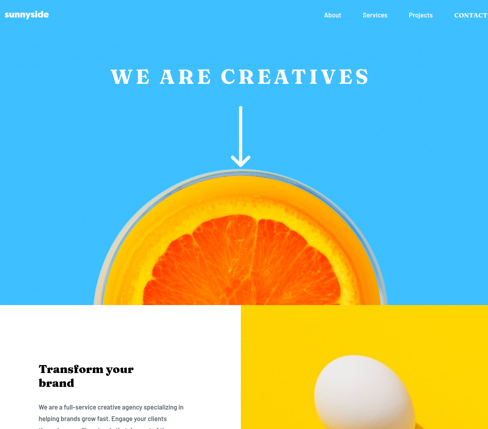

# Frontend Mentor - Sunnyside agency landing page solution

This is a solution to the [Sunnyside agency landing page challenge on Frontend Mentor](https://www.frontendmentor.io/challenges/sunnyside-agency-landing-page-7yVs3B6ef). Frontend Mentor challenges help you improve your coding skills by building realistic projects.

## Table of contents

- [Overview](#overview)
  - [The challenge](#the-challenge)
  - [Screenshot](#screenshot)
- [My process](#my-process)
  - [Built with](#built-with)
  - [Useful resources](#useful-resources)
- [Author](#author)

## Overview

### The challenge

Users should be able to:

- View the optimal layout depending on their device's screen size
- See hover states for interactive elements

### Screenshot

## My process

### Built with

- Semantic HTML5 markup
- CSS custom properties
- Flexbox
- grid
- javascript

### Useful resources

- [w3schools](https://www.w3schools.com/) - tutorial for html and css
- [MDN Web Docs](https://developer.mozilla.org/en-US/docs/Web/HTML) - Documentation for html

## Author

- github - [Tim5583](https://github.com/Tim5583)
- Frontend Mentor - [@Tim5583](https://www.frontendmentor.io/profile/Tim5583)
- Twitter - [@Praveen_TGW](https://twitter.com/Praveen_TGW)
